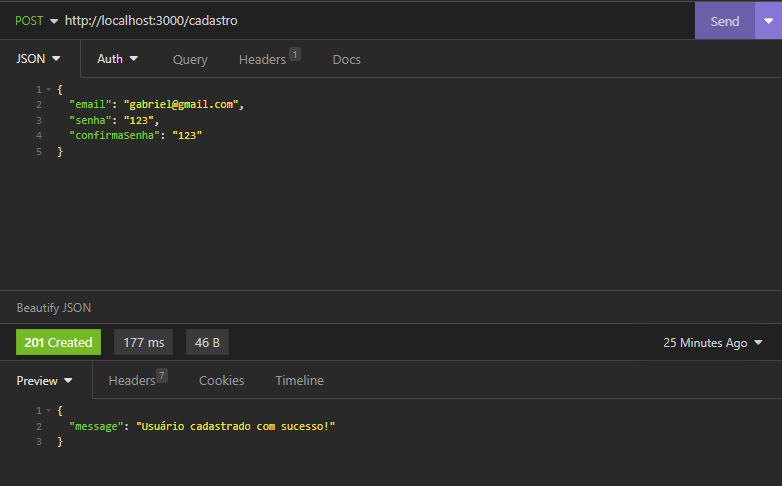
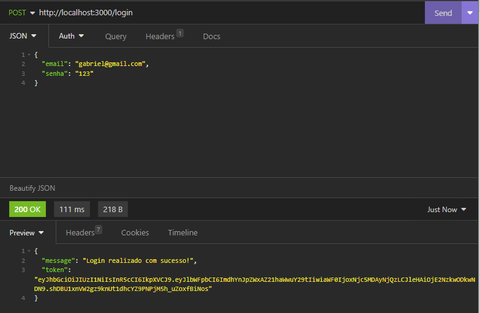
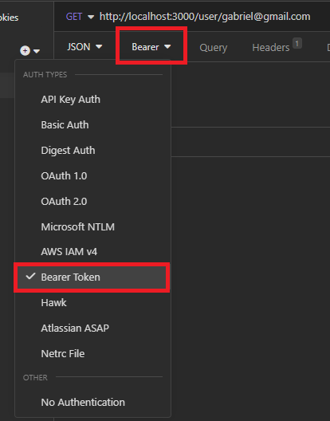
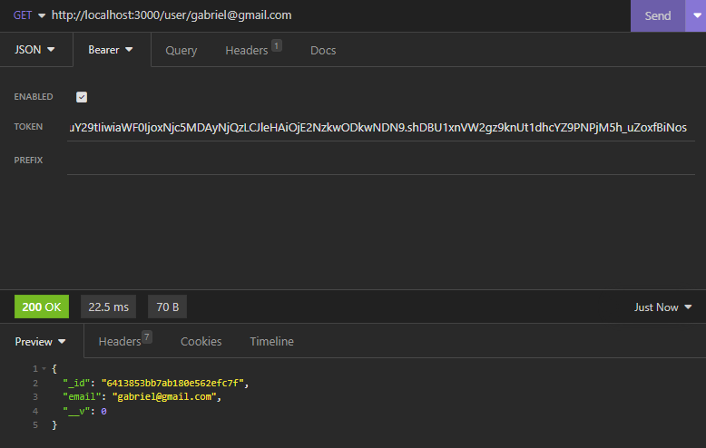
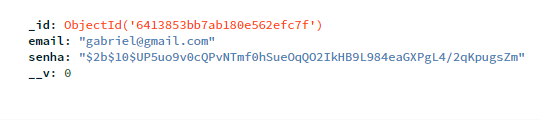

# Sobre o projeto 

Esse é um projeto backend de um sistema de login que realiza **identificação**, **autenticação** e **autorização**. Conta com rota privada, registro de usuário e algumas medidas de segurança. O projeto foi separado por diferentes pastas com o objetivo de praticar padrões de arquitetura para criar um código simples de ler e fazer manutenção.

# 🛠 O que utilizei para a criação
- **<a href="https://nodejs.org/en">NodeJS<a/>** para criar o backend da aplicação.
- **<a href="https://insomnia.rest/">Insomnia</a>** para testar as rotas, validações etc.
- **<a href="https://www.npmjs.com/package/bcrypt">bcrypt</a>** para criptografar a senha que é criada e enviada para o banco de dados.
- **<a href="https://www.npmjs.com/package/dotenv">dotenv</a>** uma biblioteca usada para armazenar variáveis de ambiente e assim criar uma segurança das informações que são sensíveis.
- **<a href="https://expressjs.com/">express</a>** um framework para o NodeJS que facilita na criação de aplicações backend.
- **<a href="https://www.npmjs.com/package/jsonwebtoken">jsonwebtoken</a>** é um padrão utilizado para segurança de informações. Usado neste projeto para criar a autorização no acesso de rotas privadas.
- **<a href="https://mongoosejs.com/docs/guide.html">mongoose</a>** é uma biblioteca usada para modelagem de dados do MongoDB, conexão com o banco, recuperação de dados do banco etc
- **<a href="https://www.npmjs.com/package/validator">validator</a>** é uma biblioteca que valida informações recebidas. Nesse projeto utilizei para validar o formato de e-mail.

# Rotas 

- **"/login"** utiliza o método POST para realizar o login.
- **"/cadastro"** utiliza o método POST para inserir um usuário e senha no banco de dados.
- **"/user/:email"** utiliza o método GET e tem como função fazer o papel da rota privada. Ou seja, só poderá acessá-la com um token válido.

# Exemplos

### 👉 Para o cadastro
Usando o Insomnia ou Postman, selecione o método POST e digite http://localhost:3000/cadastro. Logo após, preencha o body usando o formato JSON com **email**, **senha**, **confirmarSenha** para realizar o cadastro de usuário. Se estiver tudo certo, irá retornar uma mensagem de sucesso com um status 201 Created


---
### 👉 Para o login 
Selecione o método POST e digite http://localhost:3000/login. Caso a informação preenchida esteja cadastrada no banco de dados, terá uma mensagem de sucesso seguido de um token de validação.


---
### 👉 Para acesso à rota privada
Nessa rota (http://localhost:3000/user/email), apenas poderá ter acesso quando tiver um token válido. Selecione o tipo de autenticação "Bearer Token" como mostra a imagem


---
Cole o token recebido após o login no input "Token" e após confirmar, repare que se o token for validado, você irá receber um retorno de sucesso com status 200



# Segurança 🔐

Repare que graças à biblioteca bcrypt, a senha cadastrada chega ao banco de dados totalmente criptografada.


# Como executar

⚠ Como foi usado o arquivo .env para a criação do projeto e essa aplicação não está hospedada, logo após clonar o repositório, você vai precisar criar um arquivo com o nome de **".env"** e simplesmente colar as seguintes informações dentro dele:

DB_USERNAME = admin <br>
DB_PASSWORD = 4Tv6oQyZOhmfLAbm <br>
SECRET_KEY = eajuUlHFRoaMY4JGxAYmwCww4ZpfItndtDT486BJckc <br>

Essas variáveis de ambiente lhe permitirão o acesso ao banco de dados MongoDB Atlas, onde ficarão salvas as informações que forem cadastradas. Por mais que as senhas sejam criptografadas, evite usar alguma senha real.

---

- Clone este repositório
```sh
$ git clone https://github.com/GabeOP/teste-dev-backend.git
```

- Instale as dependências que estão listadas no arquivo package.json
```sh
$ npm install
```

- Execute o servidor
```sh
$ node index.js
```

Após esses três passos, o servidor deve estar rodando no http://localhost:3000 e feito a conexão com o banco de dados. <a href="https://cloud.mongodb.com/v2/6413284b02eb430572cd89e4#/metrics/replicaSet/64132934eccb2f446bd13c57/explorer/test/users/find">Clique aqui</a> caso queira visualizar esse banco de dados. Você deverá realizar o login no MongoDB Atlas.
